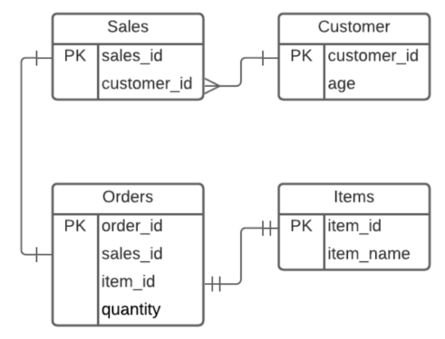

# Vidpro Deliverables

# Index
## Table of Contents

- [Index](#index)
- [Project Overview](#project-overview)
- [Problem Statement](#problem-statement)
- [Project Structure](#project-structure)
- [Technology Stack](#technology-stack)
- [Database Design](#database-design)
- [Solution Approach](#solution-approach)
- [Setup & Installation](#setup--installation)
- [Execution Guide](#execution-guide)
- [Output Description](#output-description)
- [Assumptions & Design Decisions](#assumptions--design-decisions)
- [Future Enhancements](#future-enhancements)
- [Conclusion](#conclusion)

# Project Overview

The VIDPRO Assignment project demonstrates two different approaches to solving the same data processing problem: one using **SQL queries** and the other using **Pandas in Python**. The goal is to design a structured database, process the data efficiently, and generate consistent output results using both methods.

The project includes:

- A defined database schema
- A setup script to initialize the database
- An SQL-based solution that executes queries directly on the database
- A Pandas-based solution that processes the same data in memory
- Output generation in CSV format for comparison

# Problem Statement

Company XYZ wants to analyze purchasing behavior for its signature items (x, y, z) to support targeted marketing for customers aged 18–35.

Using the provided SQLite database (Sales, Customer, Orders, Items), the task is to:

- Calculate the **total quantity of each item purchased per customer** within the target age group.
- Treat `NULL` quantities as not purchased (do not convert to zero).
- Exclude items where total quantity equals 0.
- Ensure quantities have no decimal values.
- Export the result to a CSV file using `;` as the delimiter with the header:

```
Customer;Age;Item;Quantity
```

Two separate implementations are required:

1. Pure SQL
2. Pandas (Python)

Both must produce identical output.

# Project Structure

```
vidpro_assignment/
│
├── db/
│   ├── schema.sql                  # Database schema definition
│   └── setup_db.py                 # Script to initialize SQLite database
│
├── schema/
│   └── CompanyXYZ_schema.py        # Python-based schema representation
│
├── sql_solution/
│   ├── query.sql                   # SQL query implementation
│   └── run_sql_solution.py         # Executes SQL solution and exports CSV
│
├── pandas_solution/
│   └── run_pandas_solution.py      # Executes Pandas solution and exports CSV
│
├── utils/
│   └── utils.py                    # Shared utility functions
│
├── output/
│   ├── output_sql.csv              # Output generated by SQL solution
│   └── output_pandas.csv           # Output generated by Pandas solution
│
├── controller.py                   # Orchestrates execution of the project
├── vidpro.db                       # SQLite database file
├── requirements.txt                # Python dependencies
├── simple_project.log              # Application log file
├── .gitignore                      # Ignored files and folders
└── README.md                       # Project documentation
```

# Technology Stack

- **Programming Language:** Python 3.10.8
- **Database:** SQLite3
- **Data Processing Library:** Pandas
- **Query Language:** SQL
- **Database Interface:** sqlite3 (Python standard library)
- **Version Control:** Git
- **Development Environment:** VS Code
- **Output Format:** CSV (semicolon-delimited)

# Database Design

The project uses a relational database implemented in **SQLite**, designed to model customer purchasing behavior. The schema follows normalized principles and consists of four main tables:

### 1. Customer

Stores customer details.

- `customer_id` (Primary Key)
- `age`

### 2. Items

Stores product information.

- `item_id` (Primary Key)
- `item_name` (e.g., x, y, z)

### 3. Orders

Represents purchase transactions made by customers.

- `order_id` (Primary Key)
- `customer_id` (Foreign Key → Customer)

### 4. Sales

Stores item-level purchase details for each order.

- `sale_id` (Primary Key)
- `order_id` (Foreign Key → Orders)
- `item_id` (Foreign Key → Items)
- `quantity`

### Relationships

- One **Customer** can have multiple **Orders** (1:N).
- One **Order** can contain multiple **Sales** records (1:N).
- Each **Sale** references exactly one **Item** (N:1).



# Solution Approach

- SQL Solution
- Pandas Solution

# Setup & Installation

Follow these steps to set up and run the VIDPRO assignment project:

### 1. Clone the Repository

```
git clone https://github.com/vsn99/vidpro_assignment/tree/main
cd vidpro_assignment
```

### 2. Install Dependencies

```
pip install-r requirements.txt
```

This will install all required Python libraries, including **Pandas**.

### 3. Initialize the Database

Run the setup script to create the SQLite database and apply the schema:

```
python db/setup_db.py
```

This will generate `vidpro.db` in the project root.

# Execution Guide

Once the project is set up, you can run the SQL and Pandas solutions to generate the output CSV files.

### 1. Run SQL Solution

```
python controller.py sql
```

- Executes the query in `sql_solution/query.sql`
- Generates the output file:

```
output/output_sql.csv
```

### 2. Run Pandas Solution

```
python controller.py pandas
```

- Loads data from the SQLite database using Pandas
- Processes customer-item quantities
- Generates the output file:

```
output/output_pandas.csv
```

# Future Enhancements

1. Add Unit Tests.
2. Improve Output Options.
3. Dockerization
4. Data Validation & Cleansing
5. Dividing the script into Extract, Transform, and Load for each data source. This will make managing the code easier.

# Conclusion

The VIDPRO Assignment demonstrates processing customer purchase data using **SQL** and **Pandas**, producing **consistent outputs**.

The project’s modular design ensures **maintainability and correctness**, while explicit assumptions and design decisions make it **robust**.

Future improvements like logging, testing, and CLI support can enhance **scalability and usability**.